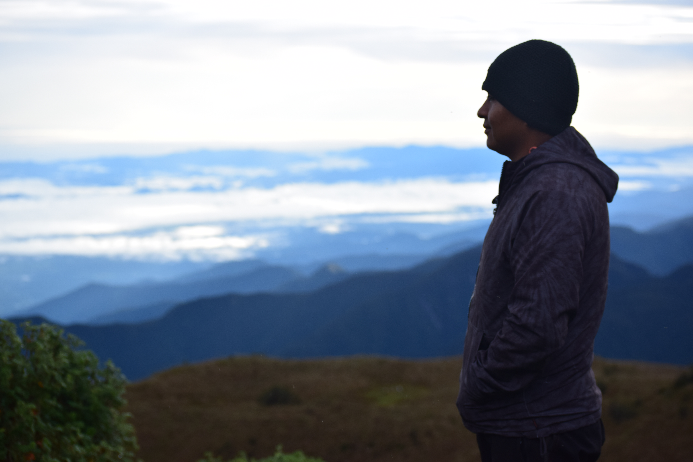

```{r, include=FALSE}
knitr::opts_chunk$set(
  results='asis', 
  echo = FALSE
)
library(glue)
library(tidyverse)
# ======================================================================
# These variables determine how the the data is loaded and how the exports are
# done.
# Is data stored in google sheets? If no data will be gather from the csvs/
# folder in project
using_googlesheets <- TRUE
# Just the copied URL from the sheet
positions_sheet_loc <-"https://docs.google.com/spreadsheets/d/1s4XV9RuLCNjL1f4qq4c8jfFed-ELOCEPXuN7bf8ZxJw/edit?usp=sharing" 
# desire googlesheets data
#"https://docs.google.com/spreadsheets/d/1eTpZBkKZH8gZJXyilYMwVmcna96mBdyhLxBB_DjQwAM/edit?usp=sharing"
# Is this sheet available for anyone to read? If you're using a private sheet
# set this to false and go to gather_data.R and run the data loading manually
# once to cache authentication
sheet_is_publicly_readable <- TRUE
# Is the goal of this knit to build a document that is exported to PDF? If so
# set this to true to have links turned into footnotes at the end of the
# document
PDF_EXPORT <- FALSE
#https://github.com/PaulESantos/cv/blob/main/cv.pdf
CV_PDF_LOC <-  "https://github.com/PaulESantos/cv_spa/raw/main/cv_spa.pdf"
  #"github.com/PaulESantos/cv/raw/master/cv.pdf"
CV_HTML_LOC <- "paulesantos.github.io/cv_spa/"
# A global (gasp) variable that holds all the links that were inserted for
# placement at the end
links <- c()
# ======================================================================
# Now we source two external scripts. One contains functions for building the
# text output and the other loads up our data from either googlesheets or csvs
# Functions for building sections from CSV data
source('parsing_functions.R') 
# Load data for CV/Resume
source('gather_data.R')
```


```{r}
# When in export mode the little dots are unaligned, so fix that. 
if(PDF_EXPORT){
  cat("
  <style>
  :root{
    --decorator-outer-offset-left: -6.5px;
  }
  </style>")
}
```

<div class="header-block">
  <div class="header-block-inner">
  <div class="title">Paul Efren Santos Andrade <br>
  <p style="font-size : 0.7rem; font-family: Playfair Display, serif; color: #454542">  </p></div>

  </div>
</div>

<div class = "subtitle">
```{r intro}
  print_text_block(text_blocks, 'intro')
```
</div>

Aside
================================================================================

{width=90%}

```{r}
# When in export mode the little dots are unaligned, so fix that. 
# title line 67 : Desirée De&nbsp;Leon
if(PDF_EXPORT){
  glue("Para acceder a la version en linea _{CV_HTML_LOC}_")
} else {
  glue("[<i class='fas fa-download'></i> Descarga el CV en formato PDF]({CV_PDF_LOC})")
}
```

Contacto {#contact}
--------------------------------------------------------------------------------

```{r}
contact_info %>% 
  glue_data("- <i class='fa fa-{icon}'></i> {contact}")
```


Programas {#skills}
--------------------------------------------------------------------------------

<i class="fab fa-r-project"></i>

<i class="fab fa-python"></i> Python

<i class="fas fa-globe-americas"></i> ArcGIS

<i class="fab fa-css3-alt"></i> CSS

<i class="fas fa-code-branch"></i> Git

<i class="fas fa-database"></i> SQL

<i class="fas fa-database"></i> Power BI

<i class="fab fa-adobe"></i> AutoCAD

<!--i class="fab fa-adobe"></i--> Photoshop


Disclaimer {#disclaimer}
--------------------------------------------------------------------------------

Elaborado con el paquete [**pagedown**](https://github.com/rstudio/pagedown). 

Código disponible en: [github.com/PaulESantos/cv_spa](https://github.com/PaulESantos/cv_spa/).

Actualizado: `r Sys.Date()`.


Main
================================================================================

Paul Efren Santos Andrade {#title}
--------------------------------------------------------------------------------

Educación {data-icon=graduation-cap data-concise=true}
--------------------------------------------------------------------------------

```{r}
print_section(position_data, 'education')
```


Experiencia {data-icon=laptop}
--------------------------------------------------------------------------------

::: aside
```{r}
print_text_block(text_blocks, 'data_aside')
```
:::

```{r}
print_section(position_data, 'research_data')
```

<br>
<br>
<br>
<br>


Talleres {data-icon=chalkboard-teacher}
--------------------------------------------------------------------------------

::: aside
```{r}
print_text_block(text_blocks, 'teaching_experience_aside')
```
:::

```{r}
print_section(position_data, 'teaching_positions')
```


<!-- These breaks just force a new page so section doesnt get cut off -->
<br>
<br>

Presentaciones {data-icon=microphone-alt}
--------------------------------------------------------------------------------

```{r}
print_section(position_data, 'talks')
```

Publicaciones {data-icon=book}
--------------------------------------------------------------------------------

```{r}
print_section(position_data, 'academic_articles')
```

Paquetes de R {data-icon=book}
--------------------------------------------------------------------------------

```{r}
print_section(position_data, 'r_packages')
```


Posters {data-icon=book}
--------------------------------------------------------------------------------

```{r}
print_section(position_data, 'posters')
```


```{r}
if(PDF_EXPORT){
  cat("
  
Links {data-icon=link}
--------------------------------------------------------------------------------
<br>
")
  
  walk2(links, 1:length(links), function(link, index){
    print(glue('{index}. {link}'))
  })
}
```


